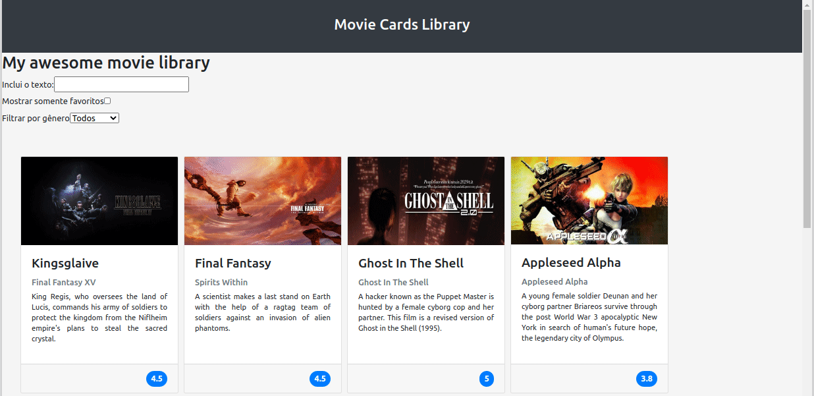

<h2 align="center">Projeto - Movie Cards Library Stateful</h2>
   
   

      Objetivo: desenvolver uma aplicação que consiste em uma biblioteca de cartões de filmes dinâmica.
   

---

<h2 align="center">Linguagens</h2>

 - HTML5
 - CSS3
 - JavaScript (ES6)
 - React

---

<h2 align="center">Resultado</h2>

---

