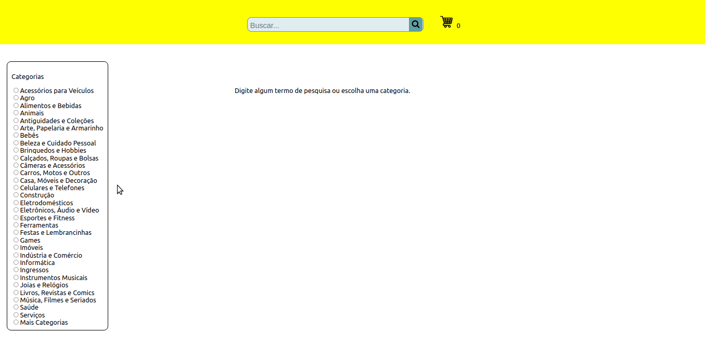

<h2 align="center">Projeto - Front-End Online Store</h2>
   
   

      Objetivo: construir o Front-End de um e-commerce, uma loja online, alimentada por uma API do Mercado Livre (https://www.mercadolivre.com.br/). 
      [Projeto original](https://github.com/tryber/sd-07-project-frontend-online-store/tree/main-group-9) desenvolvido em parceria com:
      - Carol Bezerra (https://github.com/carolbezerra-dev);
      - Felipe Alcântara (https://github.com/FelipeAlcantaraVieira);
      - Leonardo Sardinha (https://github.com/leonardocsardinha); 
   

---

<h2 align="center">Linguagens</h2>

 - CSS3
 - JSX
 - React

---

<h2 align="center">Resultado</h2>

---

