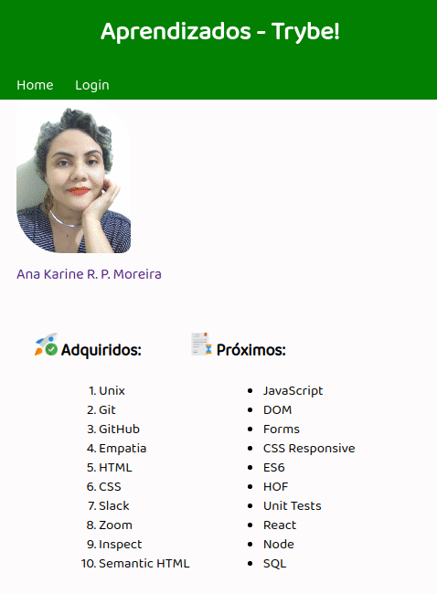

<h2 align="center">Projeto - Lessons Learned</h2>
   
   

      Objetivo: consolidar todo o conhecimento adquirido com a produção de um site, utilizando HTML e CSS. 

   

---

<h2 align="center">Linguagens</h2>

 - HTML5
 - CSS3

---

<h2 align="center">Versão desktop</h2>

---

<h2 align="center">Versão mobile</h2>

---

