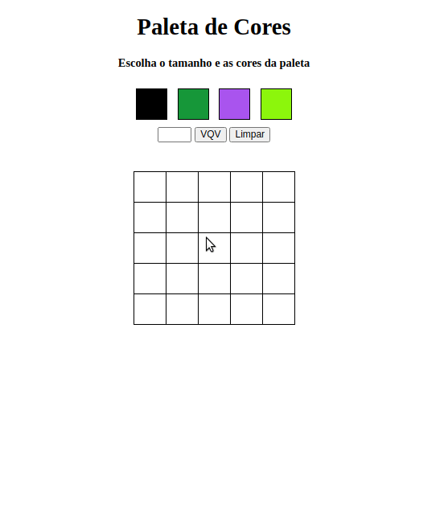

<h2 align="center">Projeto - Arte com Pixels</h2>
   
   

       Objetivo: implementar um editor de arte com pixels, ou seja, dada uma paleta de cores e um quadro composto por pixels,  
       permitir o(a) usuário(a) pintar o que quiser no quadro.
   

---

<h2 align="center">Linguagens</h2>

 - HTML5
 - CSS3
 - JavaScript (ES6)

---

<h2 align="center">Resultado</h2>

---

