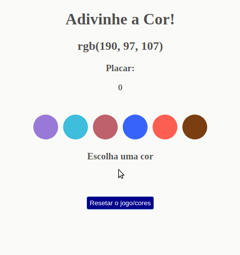

<h2 align="center">Projeto - Adivinhe a Cor</h2>
   
   

       Objetivo: implementar um adivinhador de cor RGB, ou seja, dada uma string RGB fornecer 6 alternativas visuais de cores, sendo uma delas a correta.
   

---

<h2 align="center">Linguagens</h2>

 - HTML5
 - CSS3
 - JavaScript (ES6)

---

<h2 align="center">Resultado</h2>

---

