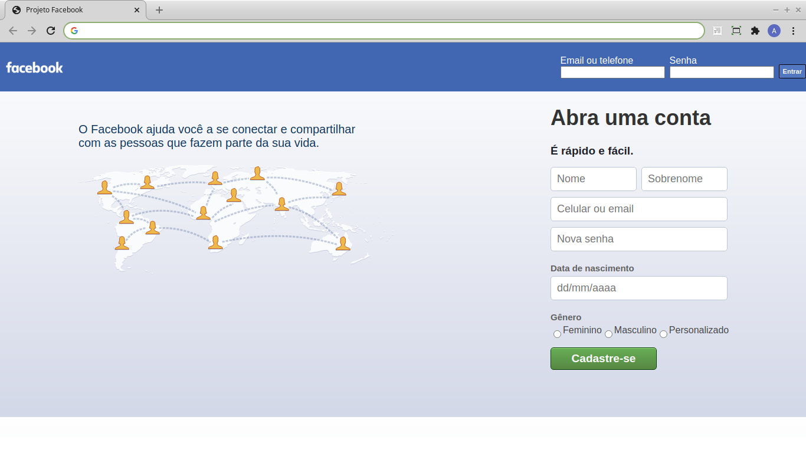
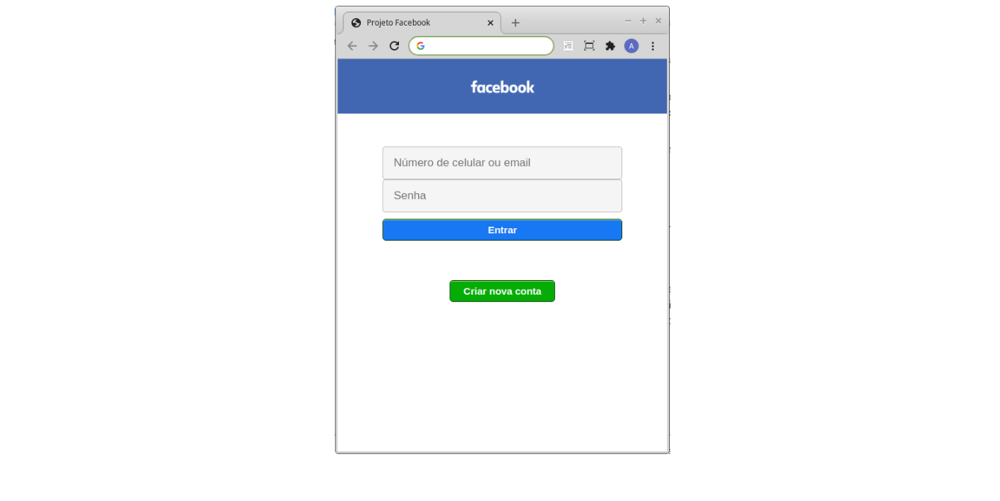

<h2 align="center">Projeto - Página inicial do Facebook</h2>
   
   

      Objetivo: recriar a tela de cadastro de uma grande empresa, como o <h4>Facebook</h4> (https://www.facebook.com/). 
      Projeto desenvolvido em parceria com Arnaelcio Gomes (https://github.com/Arnaelcio).
   

---

<h2 align="center">Linguagens</h2>

 - HTML5
 - CSS3
 - JavaScript (ES6)

---

<h2 align="center">Versão desktop</h2>

---

<h2 align="center">Versão mobile</h2>

    
---

